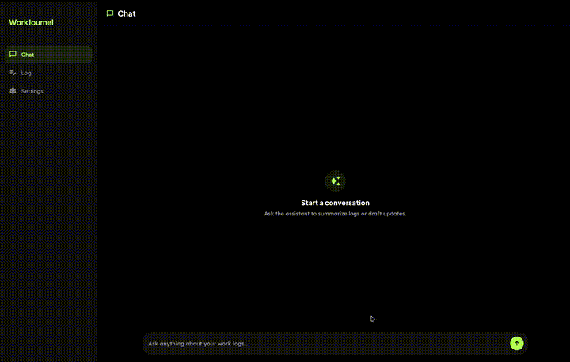

# WorkJournel

Your work, intelligently journaled. Never forget what you accomplished.

WorkJournel is a privacy-first AI work journal that helps you log daily progress in seconds. AI automatically organizes, categorizes, and summarizes your entries so you're always ready for performance reviews.

<p align="center">
  
</p>

## Download

**[Download WorkJournel v1.0.0](https://github.com/awsomedev/workjournel/releases/tag/v1.0.0)** - macOS

## Features

- **Log work in 30 seconds** - Frictionless capture for your busiest days. Just tell the AI what you worked on.
- **AI organizes everything** - Tags, summaries, and categories are generated automatically from your entries.
- **Always ready for reviews** - Generate polished brag docs and performance reports in one click.
- **Dual AI backend** - Choose between on-device local models or Claude Code CLI for higher-quality responses.

## Privacy

WorkJournel is **private by design**. Your data stays on your device.

| Mode | How it works |
|------|-------------|
| **On-Device Models** | Run Gemma, Qwen, or DeepSeek entirely on your device. Your prompts and responses never leave your machine - zero network calls, full privacy. |
| **Claude Code CLI** | Opt into Claude Code for higher-quality responses. Prompts are sent to Anthropic's API via Claude Code. Anthropic does not train on API inputs. |

You own your logs. Export or delete your entire history at any time. Your journal data is stored locally and never shared with any third party.

## Supported Local Models

| Model | Size | Best for |
|-------|------|----------|
| Gemma 3 270M | 300 MB | Fast, lightweight everyday journaling |
| FunctionGemma 270M | 284 MB | Function-calling workflows |
| Qwen3 0.6B | 586 MB | Best speed/accuracy balance |
| DeepSeek R1 Distill 1.5B | 1.7 GB | Deeper reasoning and multi-step responses |

## Setup

### Prerequisites

- [Flutter SDK](https://docs.flutter.dev/get-started/install) (3.10.8+)
- Xcode (for macOS/iOS builds)
- Android Studio (for Android builds)

### Run from source

```bash
git clone https://github.com/awsomedev/workjournel.git
cd workjournel/workjournel
flutter pub get
flutter run
```

### macOS build

```bash
flutter build macos
```

The built app will be at `build/macos/Build/Products/Release/workjournel.app`.

### iOS build

```bash
flutter build ios
```

### Android build

```bash
flutter build apk
```

### Claude Code setup (macOS only)

WorkJournel can use [Claude Code CLI](https://docs.anthropic.com/en/docs/claude-code) for higher-quality AI responses on macOS.

1. Install Claude Code CLI on your Mac
2. Open Terminal and run `claude auth login` to authenticate
3. In WorkJournel, select **Claude Code** as your model from Settings > Models

The app uses the system-installed `claude` command. No API tokens are managed within the app.

### Local model setup

1. Open WorkJournel and go to **Settings > Models**
2. Tap **Download** on any supported model
3. Wait for the download to complete - the model is automatically selected
4. Start chatting - everything runs on-device

## Tech Stack

- **Framework:** Flutter (cross-platform)
- **Local AI:** LiteRT/MediaPipe via flutter_gemma
- **Storage:** Hive (local NoSQL database)
- **Platforms:** macOS, iOS, Android

## License

(c) 2026 WorkJournel
